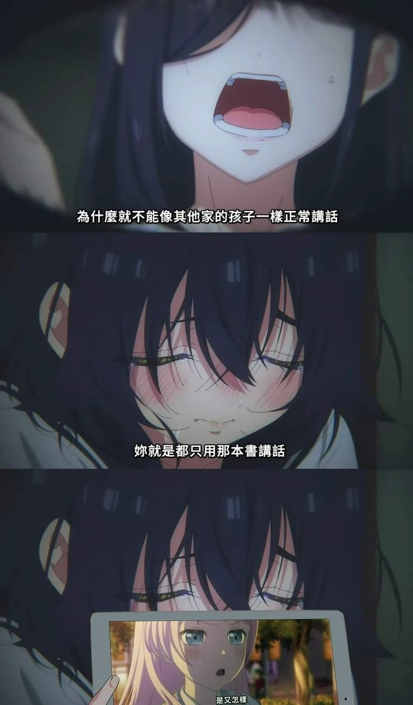

# MyGO Replyer

選取文字後會出現 MyGO icon，點擊 icon 可以透過 Gemini 取得推薦的 MyGO 截圖回覆

[](docs/go.mp4)

也可以從擴充元件的 popup 中搜尋


選中的圖片會自動複製到剪貼薄

## 安裝
1. 下載已建置的擴充元件 zip 檔後解壓縮
[https://github.com/0Miles/mygo-replyer/releases/download/v1.0.1/mygo-replyer.zip](https://github.com/0Miles/mygo-replyer/releases/download/v1.0.1/mygo-replyer.zip)

1. 在 [chrome://extensions/](chrome://extensions/) 打開右上角的 `開發人員模式`

1. 點擊 `載入未封裝項目` 按鈕，選擇第 1 步解壓縮的資料夾


## Development
```
pnpm dev
```

## Build
```
pnpm build
```

## 為什麼


## Credits
- 受 RyuuMeow 的 NeverThinkAutoReply 啟發  
https://github.com/RyuuMeow/NeverThinkAutoReply

- 使用了 MyGO-Searcher 的 API  
https://github.com/miyago9267/MyGO-Searcher

- 使用了 hydra00400 的台詞資料庫與 anon-tokyo API  
https://forum.gamer.com.tw/C.php?bsn=60076&snA=8289364
